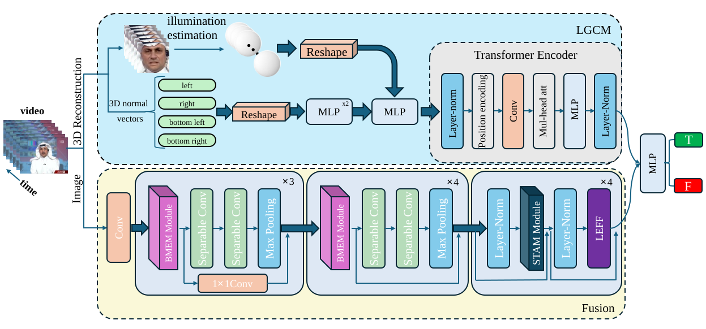

# Illumination-Features
Leveraging Spatial-Temporal Illumination Features and Convolution-Transformer Hybrid Networks for Deepfake Video Detection


## 🏗️ Method Overview


<p align="center">
  
</p>

The overall framework of our proposed method.


# 🔧 Installation


## 1. Clone repository

```bash
git clone https://github.com/SigmaLab-BJUT/Illumination-Features.git

cd Illumination-Features
```

## 2.Create environment
```
conda create -n demo python=3.10

conda activate demo

pip install torch==2.13.0+cu126 torchvision==0.28.0+cu126 \
--index-url https://download.pytorch.org/whl/cu126

pip install -r requirements.txt
```

## 📦 Pretrained Models


We provide pretrained models for evaluation and reproduction.


The pretrained weights can be downloaded from:

🔗 **Google Drive**:
[Download pretrained models](https://drive.google.com/file/d/1kv2XSMFrQU5oKa5B71Stp3vcm8jEa-Mk/view?usp=sharing)


After downloading, please place the model weights as follows:

```text
Illumination-Features
├── checkpoints
    └── best_model.pth
```

## 🎬 Test Samples


We provide several test videos for quick evaluation.

The test samples can be downloaded from:

🔗 **Google Drive**:
[Download test samples](https://drive.google.com/drive/folders/1FY_VzOEs0YRFkVp4QJ8G3UcELiPTCHpk?usp=sharing)

After downloading, please organize the files as:

```text
Illumination-Features
└── sample_data
    └── celeb-df-v2
        ├── feature
        │   ├── lmns_unsup
        │   ├── NL_unsup
        │   ├── NR_unsup
        │   ├── NBL_unsup
        │   └── NBR_unsup
        └── frames
            ├── celeb-real
            └── celeb-fake
```

## Usage

Run the script with the following command:

```bash
CUDA_VISIBLE_DEVICES=0 python infer.py \
  --checkpoint ./checkpoints/best_model.pth \
  --dataset_folder ./sample_data/celeb-df-v2/feature \
  --frames_root ./sample_data/celeb-df-v2/frames \
  --batch_size 16 \
  --num_workers 4 \
  --print_limit 20
```

## 📝 Citation

If you find this project useful, please consider citing our paper:


```bibtex
@article{zhang2025leveraging,
  title={Leveraging spatial-temporal illumination features and convolution-transformer hybrid networks for deepfake video detection},
  author={Zhang, Guoqiang and Liang, Yu and Tian, Kaiyue and Yi, Jiachen and Alsolai, Hadeel and Liu, Menglu and Hu, Xiyuan},
  journal={IEEE Transactions on Consumer Electronics},
  year={2025},
  publisher={IEEE}
}
```


